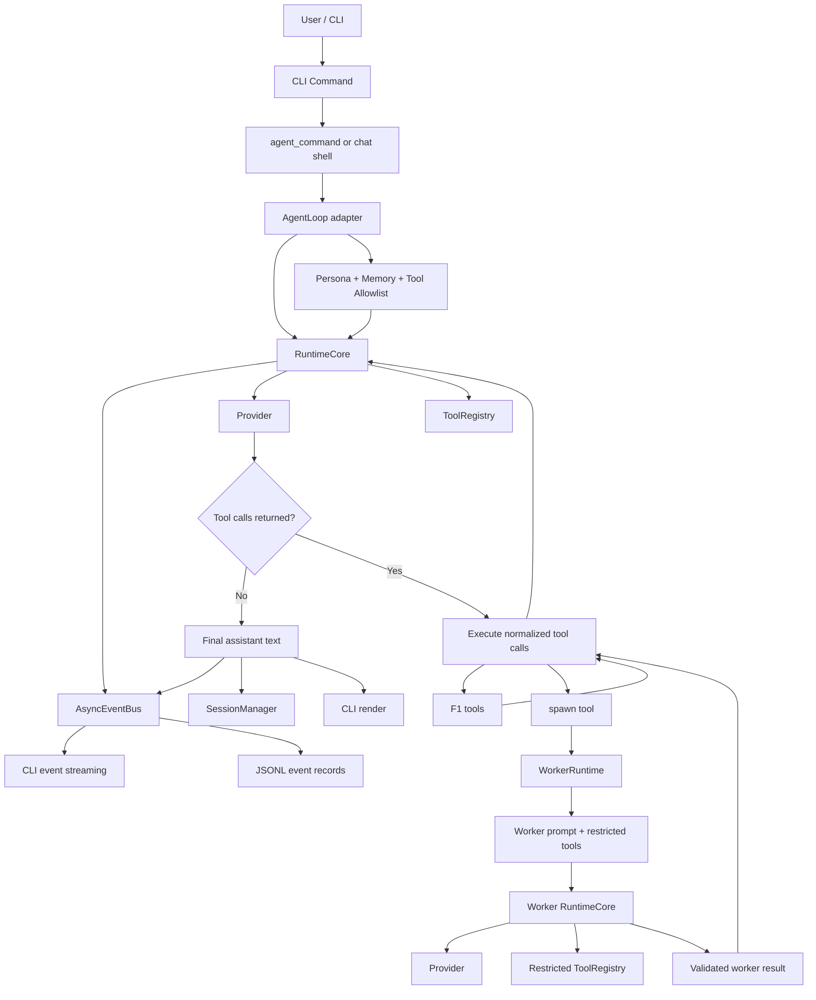

# AGENT_LOOP.md

## Purpose

This document describes the current Hannah agent runtime after the nanobot-style runtime migration slice.

The important change is simple:

- `hannah agent` is now the primary product surface
- `RuntimeCore` is now the real loop owner
- `AgentLoop` remains as a compatibility adapter
- generic bounded subagents now run through the same runtime shape
- runtime events stream to the CLI and persist to session storage

The loop is no longer best understood as a wrapper around command handlers. The command layer is now mostly ingress. The runtime is the product surface.

---

## Mental Model

Think about Hannah in this order:

1. CLI surface receives user intent
2. `AgentLoop` builds Hannah-specific context and selects the allowed tool surface
3. `RuntimeCore` runs the provider -> tool -> provider loop
4. tools own deterministic F1 work
5. `spawn` can create bounded worker runtimes with restricted tools
6. runtime events drive both terminal streaming and persisted event history

That means the loop is:

`CLI -> AgentLoop adapter -> RuntimeCore -> provider/tools/workers -> streamed + persisted results`

---

## Main Files

| File | Responsibility |
| --- | --- |
| `hannah/cli/app.py` | CLI command registration. `agent` is the primary runtime entrypoint. |
| `hannah/cli/agent_command.py` | Shared execution path for `agent` plus one-shot compatibility wrappers. |
| `hannah/cli/chat.py` | Interactive shell, session lifecycle, event subscription, and runtime rendering. |
| `hannah/agent/loop.py` | Compatibility adapter that assembles Hannah context and delegates turn execution to `RuntimeCore`. |
| `hannah/runtime/core.py` | Owns the actual agent turn loop: provider calls, tool roundtrips, worker reinjection, and event emission. |
| `hannah/runtime/context.py` | Builds message stacks for main-agent and worker turns. |
| `hannah/runtime/events.py` | Defines the allowed runtime event contract. |
| `hannah/runtime/bus.py` | Async event bus for live streaming and persistence hooks. |
| `hannah/agent/tool_registry.py` | Tool discovery, normalization, validation, and dispatch. |
| `hannah/agent/worker_runtime.py` | Generic worker runtime, spawn policy, result-contract enforcement, and worker event emission. |
| `hannah/session/manager.py` | JSONL session persistence for session-backed runtime flows. |
| `hannah/session/event_records.py` | JSON-safe serialization of runtime events into durable session records. |

---

## Runtime Surfaces

### Primary

- `hannah agent --message "..."` runs a one-shot turn through the shared runtime
- `hannah agent` on a TTY launches the interactive session-backed runtime shell

### Compatibility wrappers on the same runtime

- `hannah chat`
- `hannah ask`
- `hannah simulate`
- `hannah predict`
- `hannah strategy`

### Boundary notes

- `agent` and `chat` are session-backed surfaces
- `ask`, `simulate`, `predict`, and `strategy` stay ephemeral by default
- `sandbox`, `fetch`, and `train` are not routed through the shared `agent_command` session wrapper, but they still execute through the Hannah runtime stack where applicable

So the runtime is shared, but the UX contract is not identical across commands.

---

## Actual Turn Flow

For a normal `agent` turn, the flow is:

1. CLI collects a message
2. `hannah/cli/agent_command.py` or `hannah/cli/chat.py` creates the execution context
3. `AgentLoop` builds persona, recent memory, and the tool allowlist for the turn
4. `AgentLoop` delegates the turn to `RuntimeCore`
5. `RuntimeCore` emits `user_message_received`
6. `RuntimeCore` calls the provider with messages and tool specs
7. if the provider returns tool calls, `RuntimeCore` emits tool events, normalizes args, and dispatches tools
8. tool results are serialized and appended back into the message stack
9. if one of the tools is `spawn`, `WorkerRuntime` creates a bounded worker turn with restricted tools
10. worker results are validated against the declared result contract
11. worker results are reinjected into the parent turn as tool output
12. `RuntimeCore` repeats until the provider returns final assistant text
13. `RuntimeCore` emits `final_answer_emitted`
14. session-backed surfaces persist both chat messages and runtime event records

The LLM remains the orchestrator.

The LLM does not become the simulator.

The simulator, data, and model layers still own deterministic F1 work.

---

## Mermaid

---

## Worker Model

Workers are now generic bounded runtimes, not fixed hardcoded F1 role classes.

Each worker is created from:

- `task`
- `system_prompt`
- `allowed_tools`
- `result_contract`

Slice-1 worker policy:

- unknown `allowed_tools` are rejected
- empty tool surfaces are rejected
- nested `spawn` is rejected
- worker output must satisfy the declared `result_contract`
- worker activity emits `subagent_*` runtime events

This is the current autonomy boundary: the main agent can delegate dynamically, but only inside a restricted and auditable runtime surface.

---

## Runtime Events

The stable event contract lives in `hannah/runtime/events.py`.

Core event names:

- `user_message_received`
- `provider_request_started`
- `provider_response_received`
- `tool_call_started`
- `tool_call_finished`
- `subagent_spawned`
- `subagent_progress`
- `subagent_completed`
- `final_answer_emitted`
- `error_emitted`

The `subagent_*` family is especially important because it is consumed by:

- CLI live streaming
- acceptance tests
- JSONL event persistence

The slice contract depends on stable ordering for the worker event flow:

`subagent_spawned -> subagent_progress -> subagent_progress -> subagent_completed`

---

## Persistence Model

There are now two persistence lanes:

### Message persistence

Session-backed surfaces store user and assistant messages through `SessionManager`.

### Event persistence

The same runtime event stream is also serialized into JSONL-safe event records.

That means a session can capture:

- the user-visible conversation
- the internal runtime event history
- worker spawn and progress events

This is what makes replay, inspection, and future trace tooling practical without moving domain logic into the loop.

---

## Failure Boundaries

The runtime is designed to fail at boundaries, not by collapsing the whole turn.

- malformed tool arguments are normalized or rejected before execution
- tool failures are serialized back as tool messages
- disallowed worker specs return structured spawn-tool errors
- provider failures emit `error_emitted`
- oversized tool payloads are compacted before reinjection where required

The loop should keep orchestration alive whenever a bounded error can be represented honestly.

---

## What Did Not Change

The migration changed the runtime shape, not the ownership model.

These boundaries still hold:

- tools own simulation, prediction, strategy, telemetry, and training work
- the provider seam remains the model boundary
- the LLM does not fabricate simulator outputs
- slash/session controls do not become model messages
- Hannah remains a CLI-first F1 agent, not a generic shell agent

---

## Reading Order

Read these files in order if you need to understand the new loop:

1. `hannah/cli/app.py`
2. `hannah/cli/agent_command.py`
3. `hannah/cli/chat.py`
4. `hannah/agent/loop.py`
5. `hannah/runtime/core.py`
6. `hannah/agent/tool_registry.py`
7. `hannah/agent/worker_runtime.py`
8. `hannah/session/manager.py`
9. `hannah/session/event_records.py`
